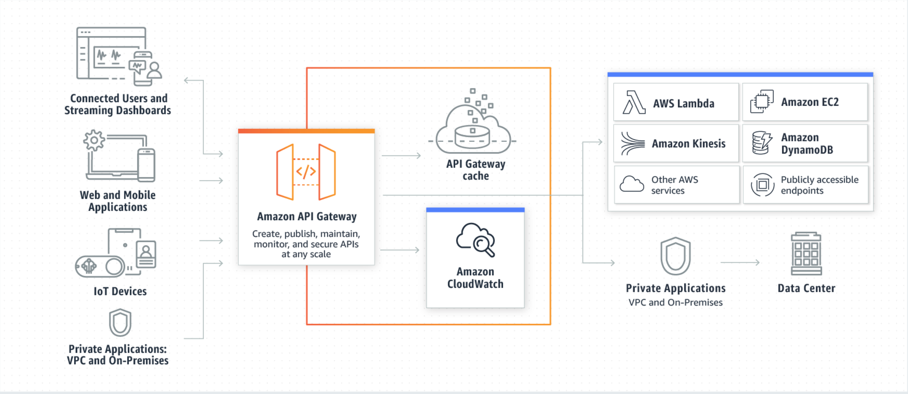

# Reading Assignment - Class 18

## Review, Research, and Discussion

### Document the following vocabulary terms

- **Serverless Functions**: Serverless functions do not require a server to be set up in order for HTTP requests to be processed. It will manage how the program responds to event triggers in the cloud, and will only run when necessary.
- **Cloud Storage**: Data can be essentially stored on the internet, and the space allocated for this storage will scale larger/smaller as appropriate to meet the memory demands of that data.
- **CDN**: CDN stands for Content Delivery Network. This structure increases performance and lowers costs because data doesn't need to travel as far to get from one endpoint to the other, as there are multiple centers spread out geographically that can behave as servers to deliver the requested data (such as video streaming services).

### Answer the following prompts and cite any external sources

- **What's the difference between a FIFO and a standard queue?**
  - FIFO functions like a standard queue, but has much less capacity to process objects; ensures that each object is processed only one time; and ensures that objects leave the queue in the order they entered.
- **How can the server be assured a message was properly received?**
  - The client app can emit an event along with the payload in response that the server can be expecting.
- **What classic design pattern is best represented by event driven programming?**
  - The concept is called event-driven architecture, which allows different client apps to "communicate" to each other by being directly connected to a server/hub that relays the events that are emitted.
- **How do you test an event driven system?**
  - You can spy on a function using `jest` to confirm it's being invoked.

## Preview - Preparation Materials

### [AWS API Gateway Overview](https://www.serverless.com/amazon-api-gateway)

AWS API Gateway handles the HTTP requests to API endpoints, and directs these requests to the correct backend.

How API Gateway integrates with other AWS services:

- **AWS Lambda**: run Lambda function sto generate HTTP API responses
- **AWS SNS**: publish SNS notifications when an HTTP API endpoint is accessed
- **Amazon Cognito**: provide authentication and authorization for your HTTP APIs

For simple HTTP API you would specify the API Gateway endpoint that you want attached to your Serverless function right in the `serverless.yml` file:

```yml
functions:
  index:
    handler: handler.hello
    events:
      - http: GET hello # this is the API Gateway event
```

Amazon API Gateway limits

- can only have 600 regional APIs per AWS account
- the shortest possible timeout for an integration in API Gateway is 50 ms, and the longest is 29 s
- max payload size that can be returned by an API endpoint is 10MB. If you're planning to return more data per request than that, you may need to split up the payload into multiple pages

### [AWS API Gateway](https://aws.amazon.com/api-gateway/)

How API Gateway Works



### [AWS DynamoDB Guide](https://www.dynamodbguide.com/what-is-dynamo-db/)

DynamoDB is a NoSQL database by AWS. It can be used with Lambda to run serverless functions.

Good fit for the following use cases:

- Applications with large amounts of data and strict latency requirements
- Serverless applications using AWS Lambda
- Data sets with simple, known access patterns

### [Dynamoose](https://dynamoosejs.com/getting_started/Introduction)

Dynamoose is the modeling tool for DynamoDB. It is with this framework that we can make CRUD requests to the DynamoDB database. Since DynamoDB is inspired by Mongoose, the syntax of these two ORMs are very similar.

## Other Resources

- [AWS DynamoDB](https://aws.amazon.com/dynamodb/)

## [Back to home](https://dcalhoun286.github.io/reading-notes/)
