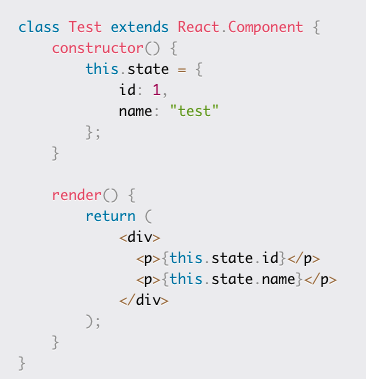
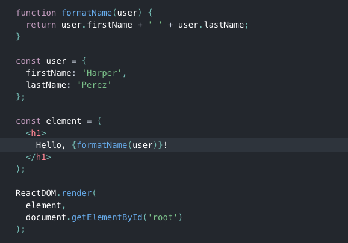
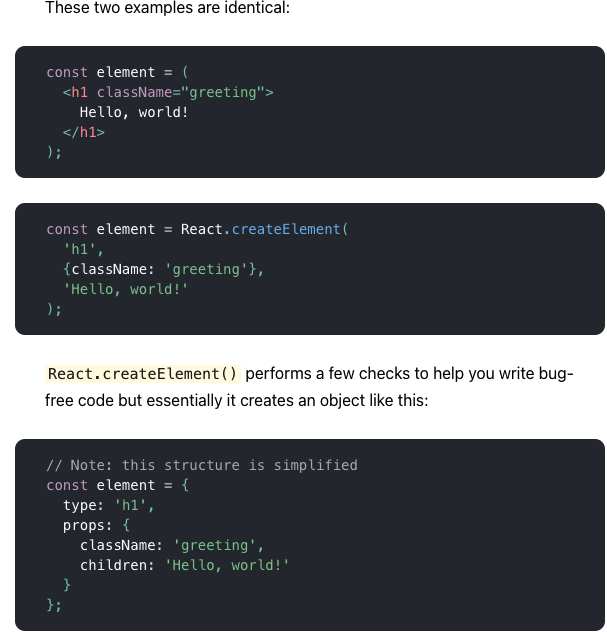

# Reading Assignment - Class 26

## Review, Research, and Discussion

### Document the following vocabulary terms

- **Rendering**: How the code is displayed in the browser
- **Templates**: Methods for processing code to be rendered efficiently. Example: `ejs`, `mustache`
- **State**: state is a built-in object within React. Components cannot pass data with state, but they can manage this data internally
  - Resource: [freeCodeCamp.org](https://www.freecodecamp.org/news/react-js-for-beginners-props-state-explained/)


### Answer the following prompts and cite any external sources

- **Name 5 JavaScript UI Frameworks (other than React)**
  - Angular, React, Vue, Ember, Meteor
  - Resource: [Hackr.io](https://hackr.io/blog/best-javascript-frameworks)
- **What's the difference between a framework and a library?**
  - With a library, the developer has control over when and where the library is being called. With using a framework, the framework is in control of the flow. The relatively less freedom given to the developer is known as being "opinionated"
  - Resource: [freeCodeCamp.org](https://www.freecodecamp.org/news/the-difference-between-a-framework-and-a-library-bd133054023f/)

## Preview - Preparation Materials

### [ReactJS - Introducing JSX](https://reactjs.org/docs/introducing-jsx.html)

- You can put any valid JavaScript expression inside the curly braces in JSX


- JSX prevents injection attacks
  - React DOM escapes any values embedded in JSX before rendering them
  - Everything is converted to a string before rendered
  - prevents XSS attacks

- JSX represents objects; Babel compiles JSX down to `React.createElement()` calls


- Recommended to use ["Babel" language definition](https://babeljs.io/docs/en/next/editors) for editor of choice so that both ES6 and JSX code is properly highlighted

### [ReactJS - Rendering Elements](https://reactjs.org/docs/rendering-elements.html)

#### Rendering an Element into the DOM

```html
<div id="root"></div>
```

- We call this a "root" DOM node because everything inside it will be managed by React DOM.
- Apps built with just React usually have a single root DOM node ;if integrating React into an existing app, you can have as many root DOM nodes as you like

- To render a React element into a root DOM node, pass both to `ReactDOM.render()`:

```javascript
const element = <h1>Hello, world</h1>;
ReactDOM.render(element, document.getElementById('root'));
```

#### Updating the Rendered Element

- React elements are immutable; the only way to update the UI is to create a new element, and pass it to `ReactDOM.render()`.

```javascript
function tick() {
  const element = (
    <div>
      <h1>Hello, world!</h1>
      <h2>It is {new Date().toLocaleTimeString()}.</h2>
    </div>
  );
  ReactDOM.render(element, document.getElementById('root'));
}

setInterval(tick, 1000);
```

#### React Only Updates What's Necessary

React DOM compares the element and its children to the previous one, and only applies the DOM updates necessary to bring the DOM to the desired state.

## Other Resources

- [ReactJS: Hello World](https://reactjs.org/docs/hello-world.html)
- [Devhints: Sass cheat sheet](https://devhints.io/sass)
- [Devhints: React cheat sheet](https://devhints.io/react)
- [reactcheatsheet.com: React cheat sheet](https://reactcheatsheet.com/)

## [Back to home](https://dcalhoun286.github.io/reading-notes/)
