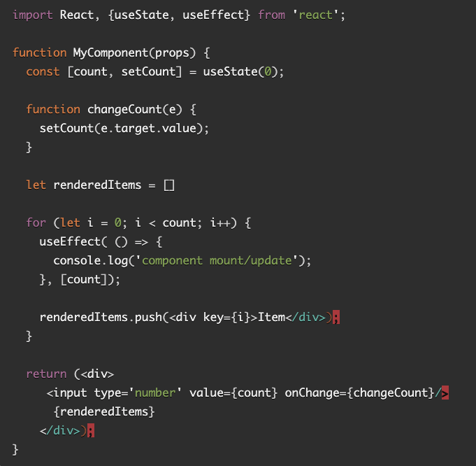

# Reading Assignment 22

## Review, Research, and Discussion

### Document the following vocabulary terms

- **State hook**: updates `state`
- **Effect hook**: handles how/if a component renders
- **Reducer hook**: this is helpful for cases in which the next state rendered is dependent on previous state to run a callback, and will return updated state for the next rendering

### Answer the following prompts and cite any external sources

- **What does a component's lifecycle refer to?**
  - The point from when a component is rendered by React to the DOM to when it is removed
- **Why do you sometimes need to "wrap" functions in `useCallback` when called from within `useEffect`?**
  - Depending on what your effect hook is doing, not wrapping a function within `useCallback` will cause an infinite loop of the function causing the component to re-render, which will in turn cause the inner function to run again.

- **Why are functional components preferred over class components?**
  - Functional components are easier to read and modularize, including for the purposes of re-using, debugging, and testing.

- **What is wrong with the following code?**

  - The for loop will cause infinite re-renders the way it is written. Instead, it should be within the `useEffect()` hook, wrapped in a `useCallBack()`.

## Preview - Preparation Materials

- [custom hooks - all you need to know](https://www.telerik.com/blogs/everything-you-need-to-create-a-custom-react-hook)
- [async hooks](https://dev.to/vinodchauhan7/react-hooks-with-async-await-1n9g)
- [useReducer Hook](https://reactjs.org/docs/hooks-reference.html#usereducer)
- [react custom hooks](https://reactjs.org/docs/hooks-custom.html)
- [Hooks Lists/Collections: use hooks](https://usehooks.com/)

## [Back to home](https://dcalhoun286.github.io/reading-notes/)
